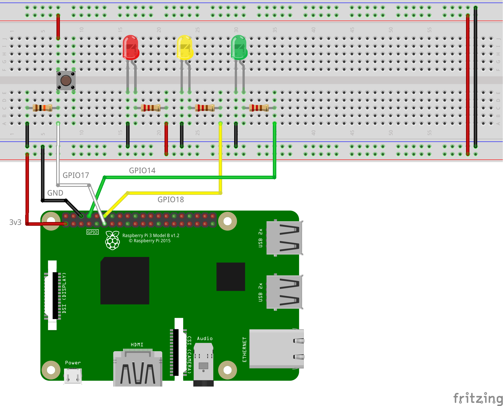

# raspi-safe-shutdown


Simple daemon service application for *Raspberry Pi* to handle a **safe shutdown button** with an indicator LED.

:information_source: This has been tested on a **Raspberry Pi 3 B**, but may also work with other versions of the board.

:warning: **Disclaimer**: I am not responsible for any possible damage you may cause to your boards.

## Demo

Demonstration video:

<video width="100%" controls>
    <source src="demo.mp4">
    <a href="https://dmotte.github.io/raspi-safe-shutdown/#demo" target="_blank">Watch it on GitHub Pages</a>
</video>

## Circuit

To use this application you just need to connect two components to your Raspberry Pi via GPIO: an **LED** and a **button**. However, I also find very useful to know when the board is powered and when the operating system is running. This can be achieved by connecting two more LEDs.

The ideal scenario is therefore the following:

- The **button** should be connected to the `GPIO_GEN0` pin (`BCM #17`)
- The **red LED** (optional) should be connected to **3v3**
  - it is ON when the board is powered, even if the OS is not running
- The **yellow LED** should be connected to the `GPIO_GEN1` pin (`BCM #18`)
  - it is the indicator LED for the *raspi-safe-shutdown* application
- The **green LED** (optional) should be connected to the `UART0_TXD` pin (`BCM #14`)
  - it is ON only when the operating system is up and running

To make the green LED work as explained, you need to have **Serial communication** enabled on the Raspberry Pi. To do this, log in and execute the following command:

```bash
sudo raspi-config nonint do_serial 0
```



## Installation

> :warning: **Warning**: Always examine scripts downloaded from the internet before running them locally.

To install or update *raspi-safe-shutdown* into your Raspberry Pi, connect it to the internet and execute the following command:

```bash
curl -sSL https://raw.githubusercontent.com/dmotte/raspi-safe-shutdown/main/get.sh | sudo bash
```

This will automatically download the latest version of this software and install a **systemctl** service for running it in the background.

## Compiling

> **Note**: these instructions are useful if you want to compile *raspi-safe-shutdown* manually, but you don't necessarily have to. If you just want to install it on your Raspberry Pi, then go to the [Installation](#installation) section.

> **Note**: this has been tested on a fresh installation of [**Raspberry Pi OS Lite**](https://www.raspberrypi.org/software/operating-systems/).

First of all, update the APT package lists:

```bash
sudo apt update
```

Install **Git** and the **WiringPi** library:

```bash
sudo apt install git wiringpi
```

Clone this repo to your *Raspberry Pi* device and `cd` into the folder:

```bash
git clone https://github.com/dmotte/raspi-safe-shutdown.git
cd raspi-safe-shutdown
```

Compile the `main.cpp` file with the **G++** compiler:

```bash
g++ -Wall -o raspi-safe-shutdown main.cpp -lwiringPi
```

The result of the compilation is the `raspi-safe-shutdown` executable file.
